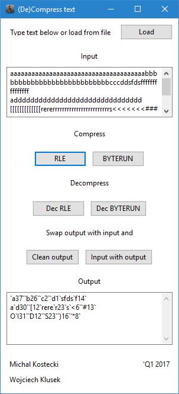
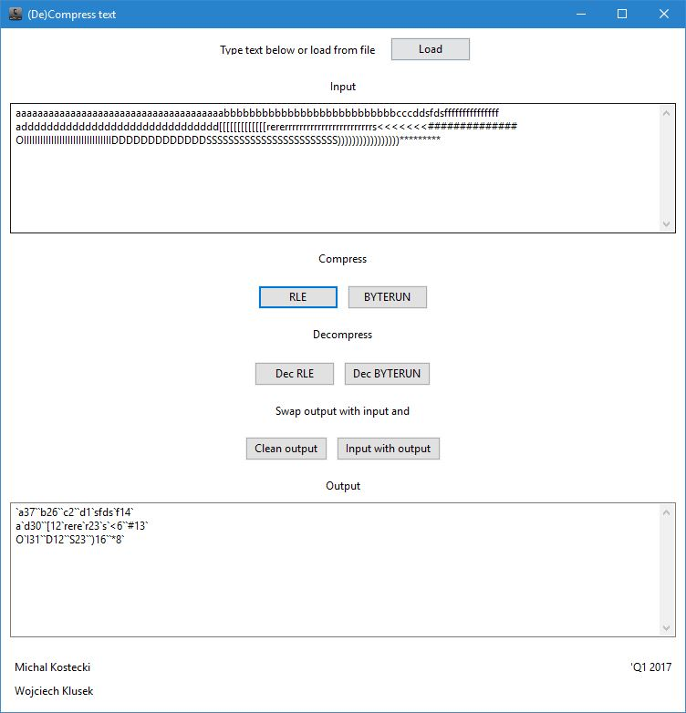
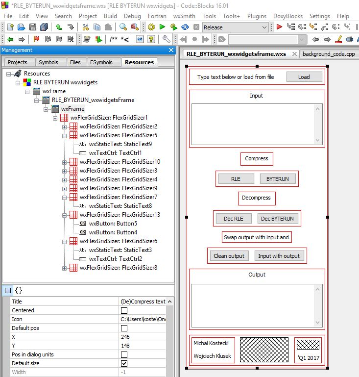
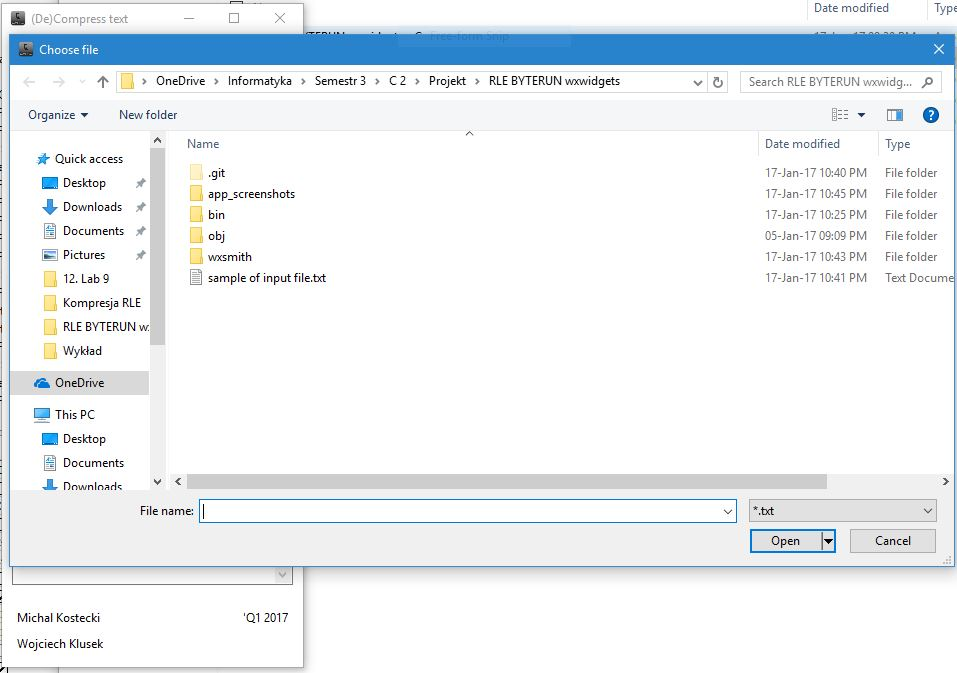

# RLE-and-BYTERUN-compress-wxwidgets
This is wxwidgets (GUI) application which compresses text typed by user or chosen from file. Written in C++ using Code::Blocks as IDE.

####About alghoritms
RLE (Run Length Encoding) and ByteRun are compressing/decompressing text to make size smaller without loosing any information. If You would like to know more about them please follow the link: [RLE and ByteRun](https://en.wikipedia.org/wiki/Run-length_encoding "RLE")

####Using the application
To simply test an app download files from bin/Debug folder - one \*.exe and two \*.dll. Make sure that all of them are in the same folder or aplication won't start. For easy testing read from file in main folder there is a file called "sample of input file.txt". 

##App screenshots:
###App design

###App responsiveness:

###App developing:

###App opening file to read:

